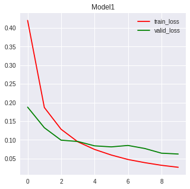
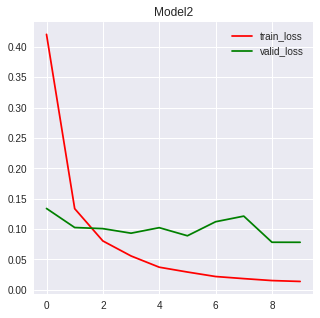
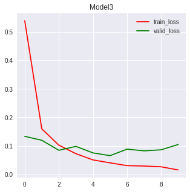
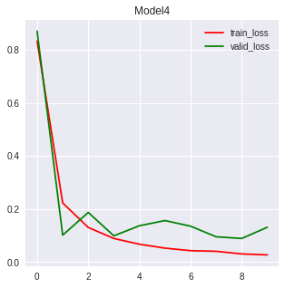
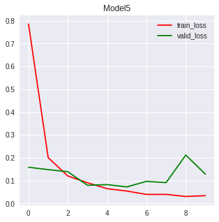

# Assignment1

    Experiment 1 :  Comparison of Different Depth of Networks
    Experiment 2 :  Comparison of Different Width of Layers
    Experiment 3 :  Comparison of Different Loss Functions
    Experiment 4 :  Comparison of Different Activation Functions

## 1. Problem Setup
1. Default Layer Depth : 3
2. Default Layer Width : 512
3. Default Loss Function : categorical_crossentropy [(More detail)](https://keras.io/losses/#categorical_crossentropy)
4. Default Activation Function : ReLU [(More detail)](https://keras.io/activations/#relu)
5. MNIST Dataset
6. Fixed Optimizer = 'rmsprop' (and Default parameters [(see)](https://keras.io/optimizers/#rmsprop))
7. Fixed epochs = '10'
8. Fixed batch_size = '512'
9. Fixed validation_split = '0.1'
10. \# of validation set = 6000
11. \# of training set = 54000

## 2. Experiment Result 
## 2.1 Experiment 1 : Comparison of Different Depth of Networks

|Models |Depth|Train Duration(s)| Test_Acc | Test_loss |
|:-----:|:---:|:---------------:|:--------:|:---------:|
|Model 1| 1   |21.0873          |0.9807    |0.0630     |
|Model 2| 3   |30.3002          |0.9827    |0.0867     |
|Model 3| 4   |29.8534          |0.9814    |0.0767     |
|Model 4| 5   |35.9210          |0.9759    |0.1064     |
|Model 5| 9   |34.4833          |0.9799    |0.0907     |

| | | | |
|-|-|-|-|
|||||
|||

## 2.1 Experiment 2 : Comparison of Different Width of Layers

|Models |Width|Train Duration(s)| Test_Acc | Test_loss |
|:-----:|:---:|:---------------:|:--------:|:---------:|
|Model 1| 64  |19.5668          |0.9684    |0.1093     |
|Model 2| 128 |20.2792          |0.9790    |0.0716     |
|Model 3| 256 |16.8353          |0.9775    |0.0933     |
|Model 4| 512 |18.9405          |0.9825    |0.0818     |
|Model 5| 1024|33.9161          |0.9824    |0.0899     |

## 2.1 Experiment 3 : Comparison of Different Loss Functions
|Models  |Loss Functions                 |Train Duration(s)| Test_Acc | Test_loss  |
|:------:|:-----------------------------:|:---------------:|:--------:|:----------:|
|Model 1 |mean_squared_error             |26.4315          |0.9795    |0.0033      |
|Model 2 |mean_absolute_error            |24.8346          |0.9687    |0.0062      |
|Model 3 |mean_absolute_percentage_error |20.7890          |0.9569    |4303735.5179|
|Model 4 |mean_squared_logarithmic_error |22.8956          |0.9789    |0.0017      |
|Model 5 |squared_hinge                  |25.6684          |0.9700    |0.9026      |
|Model 6 |hinge                          |52.7555          |0.9717    |0.9028      |
|Model 7 |categorical_hinge              |78.1357          |0.9691    |0.0601      |
|Model 8 |logcosh                        |15.9497          |0.9826    |0.0013      |
|Model 9 |categorical_crossentropy       |12.8994          |0.9846    |0.0752      |
|Model 10|sparse_categorical_crossentropy|-                |-         |-           |
|Model 11|binary_crossentropy            |16.9071          |0.9953    |0.0206      |
|Model 12|kullback_leibler_divergence    |17.4945          |0.9807    |0.0929      |
|Model 13|poisson                        |13.1506          |0.9781    |0.1113      |
|Model 14|cosine_proximity               |13.3585          |0.9771    |-0.9799     |

## 2.1 Experiment 4 : Comparison of Different Activation Functions
|Models  |activation function|Train Duration(s)| Test_Acc | Test_loss  |
|:------:|:-----------------:|:---------------:|:--------:|:----------:|
|Model 1 |softplus           |29.5852          |0.9558    |0.1442      |
|Model 2 |softsign           |25.4011          |0.9757    |0.0808      |
|Model 3 |relu               |23.6730          |0.9743    |0.1243      |
|Model 4 |tanh               |31.3144          |0.9799    |0.0670      |
|Model 5 |sigmoid            |30.8801          |0.9617    |0.1239      |
|Model 6 |hard_sigmoid       |64.9374          |0.9631    |0.1188      |
|Model 7 |linear             |88.4039          |0.8928    |0.3780      |

## 3. Conclusion 

